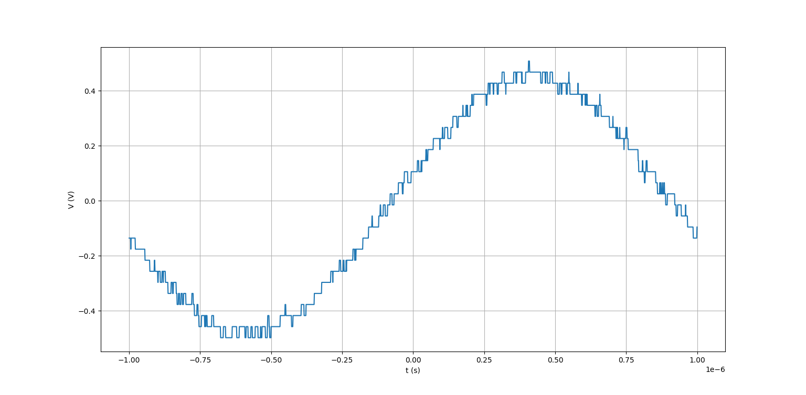

# 06-10-2023

## Digitalização

Pra ler um sinal digital, precisa-se primeiro condicioná-lo, adequando o sinal pra melhor forma possível de digitalização. Depois da digitalização, perde-se informação.

* 8 bits  -> 256   níveis
* 10 bits -> 1024  níveis
* 12 bits -> 4096  níveis
* 16 bits -> 65536 níveis

Limite de quantização : $Q = \frac{\Delta V}{2^n -1}$

Padrão TTL: 
* $0$ - > $0V$
* $1$ - > $5V$

### Conversor DA

Um conversor DA pode funcionar a base de um AmpOp somador, com peso em cada entrada:

Na imagem acima, cada $D$ corresponde a um bit.

### Conversor AD

Existem alguns modelos de conversão AD. Um dos mais usados é o Modelo de Aproximação Sucessiva (SAM).

### Conversor Osciloscópio

O osciloscópio EDUX1002A realiza a conversão analógica digital com um conversor de $8$ bits. A conta foi feita a partir da equação do Limite de Quantização acima. Para os dados abaixo, que foram capturados em uma escala ($\Delta V$) de 10V, com um $Q = 0.004$, temos:

$0.004 = \frac{10}{2^n - 1}$

$2^n = \frac{10}{0.004} + 1$

$n = log_2(251)$

$n \approx 8$

