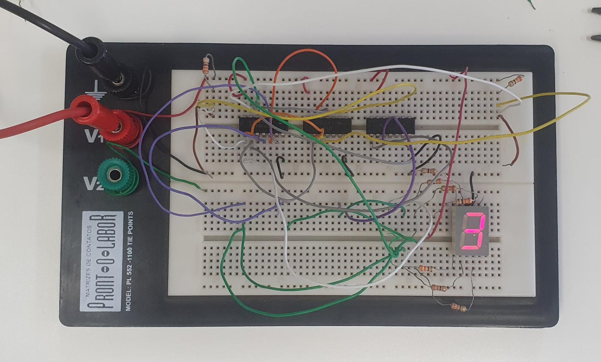

# 27-10-2023

## Eletronica Digital - Expressões Booleanas

    NOTA #1
    A + B (OU)
    A * B (E)

* **NOT gate**

|  A | Ā |
|----|---|
|  0 | 1 | 
|  1 | 0 | 

* AND gate

|  A | B |  A * B|
|----|---|-------|
|  0 | 0 |    0  |
|  0 | 1 |    0  |
|  1 | 0 |    0  |
|  1 | 1 |    1  |

* **OR gate**

|  A | B |  A * B|
|----|---|-------|
|  0 | 0 |    0  |
|  0 | 1 |    1  |
|  1 | 0 |    1  |
|  1 | 1 |    1  |

* **XOR gate**

|  A | B |  A * B|
|----|---|-------|
|  0 | 0 |    0  |
|  0 | 1 |    1  |
|  1 | 0 |    1  |
|  1 | 1 |    0  |

* **NAND gate**

|  A | B |  A * B|
|----|---|-------|
|  0 | 0 |    1  |
|  0 | 1 |    1  |
|  1 | 0 |    1  |
|  1 | 1 |    0  |

### Identidades 

* Comutatividade:

$$A + B = B + A$$

* Associatividade:
$$(A + B) + C = A + (B + C)$$

* Distributividade

$$A\cdot (B + C) = A \cdot B + A \cdot C$$

* De Morgan

$$\overline{A \cdot B} = \overline{A} + \overline{B}$$

$$\overline{A + B} = \overline{A} \cdot \overline{B}$$

* Expressões Auxiliares

### Mapa de Karnaugh

[Karnaugh Map, Wikipedia](https://en.wikipedia.org/wiki/Karnaugh_map)

[Vídeo sobre o Mapa de Karnaugh](https://www.youtube.com/watch?v=xB99jX9QMOE)

## Prática

Para essa prática, foram usados três circuitos integrados, o *SN7402*, *SN7404* e o *SN7408*, para montar, a partir do vídeo abaixo, um circuito de um display de 2 bits.

[Vídeo sobre a prática do display de 7 segmentos](https://www.youtube.com/watch?v=_fl-PbZxvhs)

Abaixo, o circuito final:

