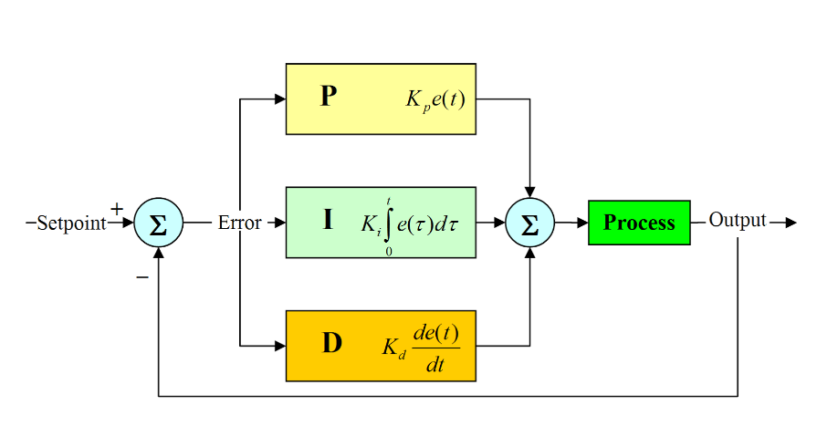
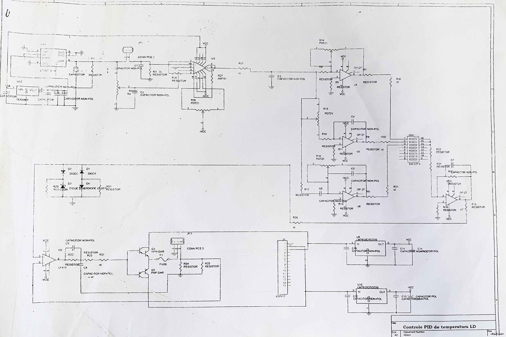
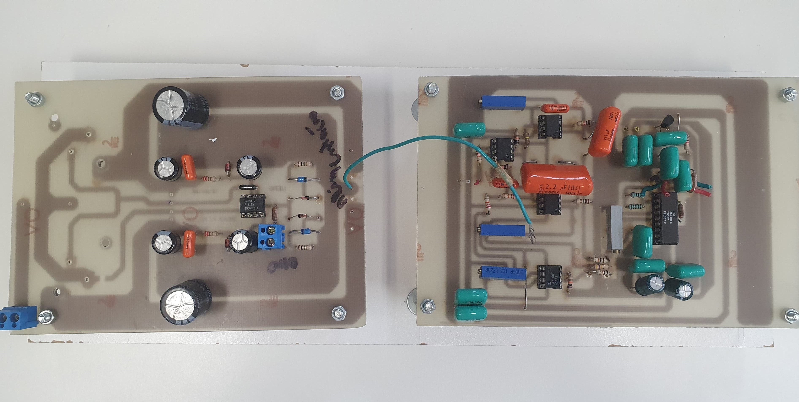
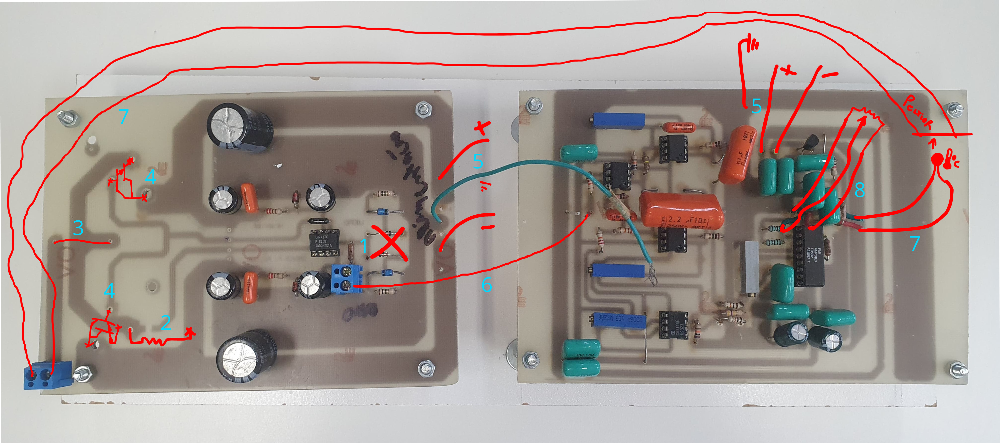
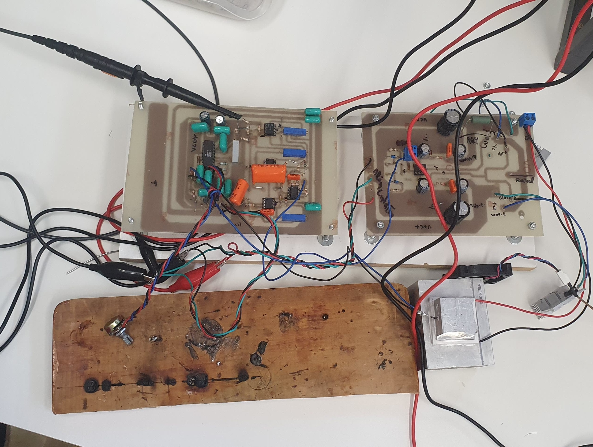
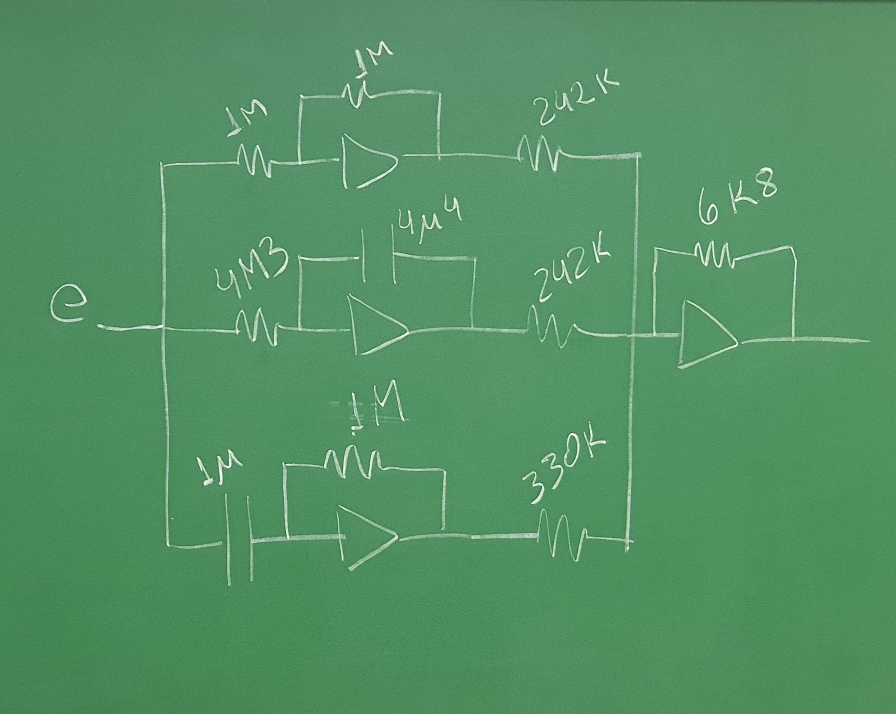
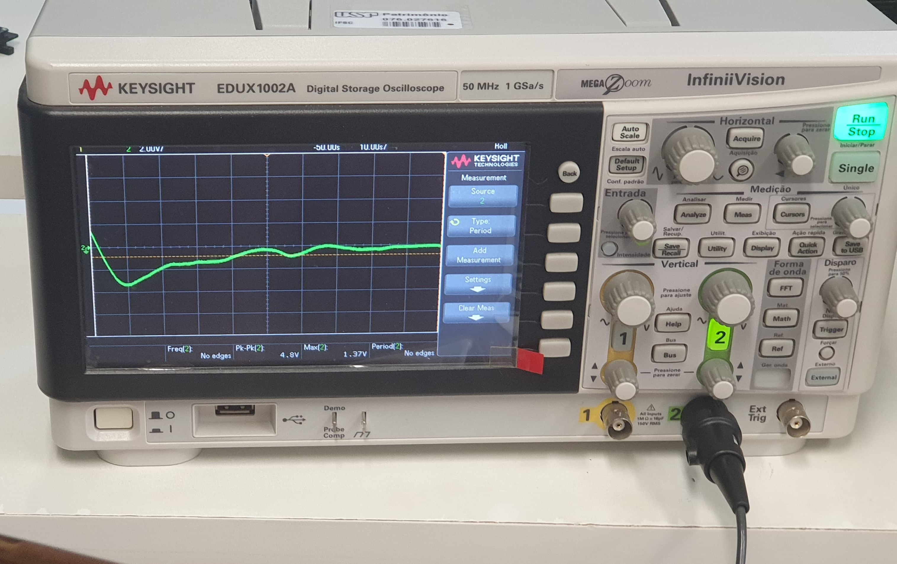

# 24-11-2023

## PID

    # NOTA 1

    Malha aberta: A entrada não é modificada de acordo com a saída. Exemplo: Instruo uma máquina a mover 1cm, ela move o que parece ser 1cm, sem se importar com a precisão. 

    Malha fechada: A entrada é modificada de acordo com a saída para garantir que a atuação seja feita da maneira mais próxima possível ao desejado. Exemplo: Instruo uma máquina a mover 1cm, ela se move o que parece ser 1cm, descubro que movi 1.03cm, portanto instruo a máquina a se mover -0.03cm, e repito esse processo até de fato ter me movido 1cm.

O [**PID**](https://pt.wikipedia.org/wiki/Controlador_proporcional_integral_derivativo), controle Proporcional Integral Derivativo, é um circuito de controle que se utiliza de técnicas de um circuito proporcional, integral e derivativo fazendo assim com que o sinal de erro seja minimizado pela ação proporcional, zerado pela ação integral e obtido com uma velocidade antecipativa pela ação derivativa.

O sinal de saída do PID opera como uma equação diferencial que, a partir do sinal de entrada, nesse caso o erro do sinal atual com relação ao sinal desejado, fornece um sinal de saída que procura minimizar o erro para que o sinal atual se aproxime o quanto possível do sinal alvo.

$$u(t) = G_p e(t) + G_i \int_0^t e(\tau) d\tau + G_d \frac{d e(t)}{dt}$$

- $G_p$ : Ganho Proporcional
- $G_i$ : Ganho Integral
- $G_d$ : Ganho Derivativo
- $e$ : Erro
- $t$ : tempo
- $\tau$ : Tempo de integração

Abaixo, um exemplo de como o termo derivativo, em conjunto com os outros dois, age sobre o sinal:

## Trabalho

Como método de estudo de circuitos PID, um conjunto de placas que compunham um circuito de regulação de temperatura foi analisado. O esquema desse sistema é:

Esse conjunto de placas, porém, tinha vários problemas de design e falta de componentes, os quais consistiam a dinâmica da atividade. A tarefa de cada grupo foi de, por meio de um processo de engenharia reversa, consertar as placas para que funcionassem em conjunto novamente.

Primeiro, foi necessário fazer uma identificação inicial do que se tratava cada etapa dos circuitos. Para isso, foram feitas imagens comparativas entre o circuito e o esquema teórico:

Após avaliação inicial, os problemas identificados na placa foram:

1. Ausência de dois diodos na ponte.
2. Falta de resistência de dissipação.
3. Falta de conexão entre o peltier e a conexão entre os transistores.
4. Falta dos transistores.
5. Falta das alimentações.
6. Falta de conexão entre as placas.
7. Falta do sensor de temperatura.
8. Falta de Divisor de Tensão para regular a temperatura desejada.

Depois de resolver esses vários problemas, chegou-se no circuito final:

Porém, ainda faltava uma etapa. Por mais que todos os componentes estivessem conectados, ainda faltava regular os ganhos de cada etapa do PID. A regulação desses ganhos era importante pois, para determinados ganhos, o sistema oscilava indefinidamente. Calculou-se qual deveria ser a configuração de resistências para alterar o tempo de descarga dos capacitores ligados aos amplificadores, chegando no seguinte resultado:

Que enfim rendeu: 

Aqui é possível perceber um sistema amortecido, como era esperado.