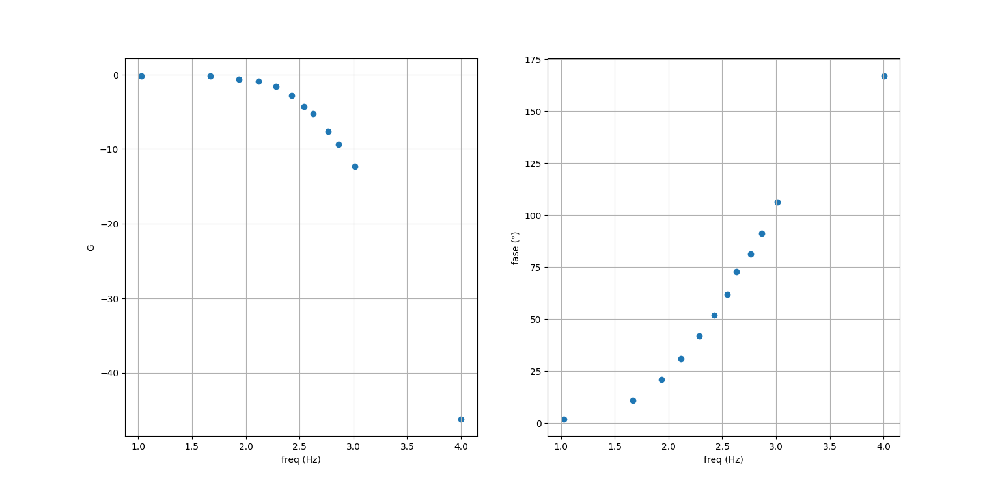

# 22-09-2023

## Filtro Sallen-Key

Com $Z1$ e $Z2$ resistores e $Z3$ e $Z4$ capacitores, o circuito deve funcionar como um filtro passa-baixa.

Os dados estão presentes no arquivo `diag_bode.py`, e os resultados abaixo:

