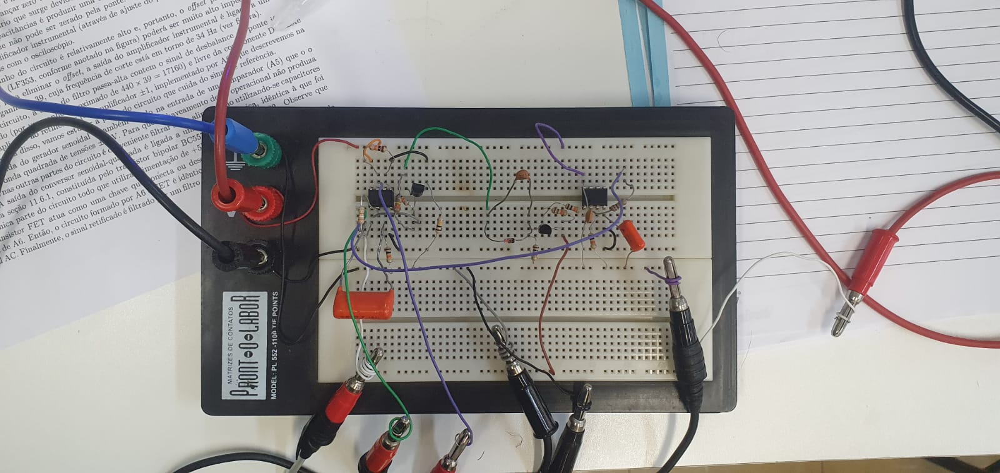
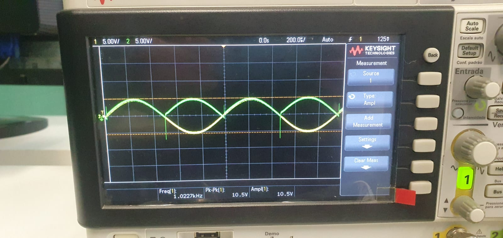

# 29-09-2023

## Moduladores e Demoduladores

Usar um modulador e demodulador em um sinal é o ato de injetar um sinal AC de fase e frequência conhecida, e receber ele o multiplicando por um sinal de "mesma" fase e frequência (considerando um adicional de fase de resposta oferecido pelo sistema) como maneira de filtrar aquele sinal específico e ler apenas ele.

Na modulação, é possível modular sinais com carregadores analógicos ou digitais:

Existem três tipos de modulação:
1. Amplitude
2. Frequência
3. Fase

Dois desses tipos, por sinal, são usados em modulações de rádio, a Modulação de Amplitude (AM) e a Modulação de Frequência (FM).

    NOTA #1:
        Um componente integrado que age como modulador/demodulador é o AD630.

Foi feita a montagem de um modulador e demodulador da seguinte maneira:

Que rendeu os seguinte resultado:

